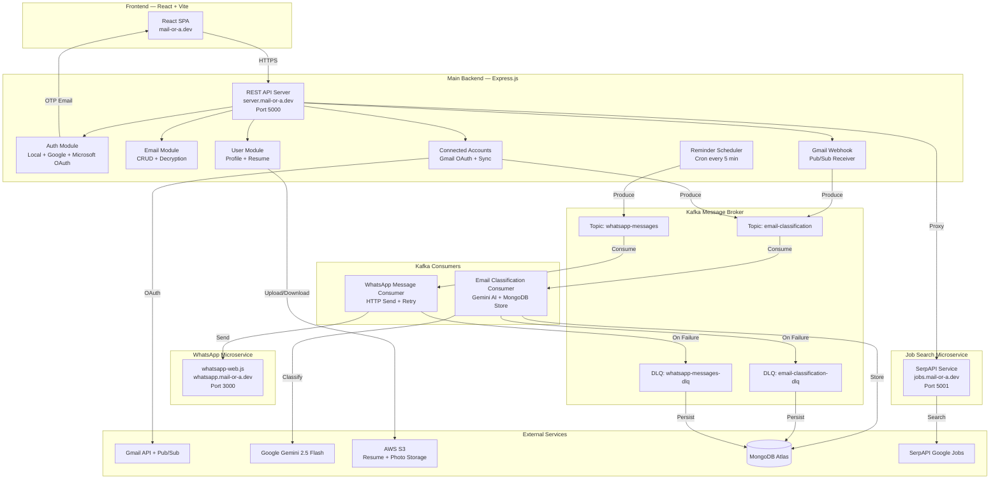

# Mail-or-a — Complete Project Overview

## 1. Problem Statement

Job seekers and students today receive hundreds of emails about job openings, internships, hackathons, and workshops across multiple email accounts. Manually tracking application deadlines, follow-ups, and interview schedules is overwhelming and error-prone. Critical opportunities are missed because:

- **Email overload** — Important opportunity emails get buried in cluttered inboxes
- **No centralized tracking** — Users juggle multiple Gmail/Outlook accounts with no unified view
- **Missed deadlines** — Without proactive reminders, application windows close silently
- **No intelligent filtering** — Users manually classify which emails are actionable opportunities vs. noise
- **Fragile notification delivery** — If a reminder service is temporarily down, the notification is lost forever

## 2. Proposed Solution

**Mail-or-a** is a full-stack SaaS platform that automatically ingests emails from connected Gmail accounts, classifies them using **Google Gemini AI**, organizes them into a smart dashboard by category and stage, and sends **WhatsApp deadline reminders** via a fault-tolerant **Apache Kafka** message pipeline.

### Core Value Propositions
1. **AI-Powered Email Classification** — Gemini 2.5 Flash classifies emails into categories (job/internship/hackathon/workshop) and stages (registration/registered/inprogress/confirmed)
2. **Multi-Account Gmail Sync** — Connect up to 3 Gmail accounts with real-time webhook + manual sync
3. **Smart Deadline Reminders** — Automated WhatsApp notifications at 3 days, 24 hours, 12 hours, and 1 hour before deadlines
4. **Fault-Tolerant Messaging** — Kafka ensures zero message loss with exponential backoff retries and dead-letter queues
5. **IT Job Search Engine** — SerpAPI-powered job search across 7 IT roles with daily auto-refresh
6. **AI Resume Parsing** — Upload resume → Gemini extracts skills, experience, education, and projects automatically

## 3. System Architecture



## 4. Detailed Workflow

### 4.1 User Registration & Authentication Flow
```
User → Signup Page → Enter name, email, password
  → Backend sends 6-digit OTP to email (Nodemailer)
  → User enters OTP on verification page
  → Backend verifies OTP → Creates user in MongoDB
  → User can now login with email/password

Alternative: Google OAuth / Microsoft OAuth
  → Redirect to provider → Callback → Find-or-create user → JWT cookie set
  → Redirect to frontend /auth/callback with token
```

### 4.2 Gmail Connection & Email Ingestion Flow
```
User → Profile Page → "Connect Gmail"
  → OAuth redirect to Google (gmail.readonly + gmail.modify scopes)
  → Callback → Store tokens in ConnectedAccount collection
  → Start Gmail watch() → Google Pub/Sub registered

Two ingestion paths:

PATH A — Real-time (Production):
  New email arrives → Google Pub/Sub → POST /webhook/gmail
  → Extract email data → Produce to Kafka topic: email-classification

PATH B — Manual Sync (Dev/On-demand):
  User clicks "Sync" → GET /api/accounts/:id/sync
  → Gmail History API or list recent 20 messages
  → Extract email data → Produce to Kafka topic: email-classification
```

### 4.3 Kafka Email Classification Pipeline
```
Kafka Topic: email-classification
  → Consumer picks up message
  → Calls Gemini 2.5 Flash with classification prompt
  → Returns: { category, stage, deadline, matter, links }
  → Encrypts sensitive fields (AES-256-CBC)
  → Stores in correct MongoDB collection based on stage:
      registration → RegistrationEmail (has deadlineDate)
      registered   → RegisteredEmail
      inprogress   → InProgressEmail (has deadlineDate)
      confirmed    → ConfirmedEmail
  → If deadline exists → Creates Reminder documents

On Failure:
  → Retry 1: wait 1s → Retry 2: wait 2s → ... → Retry 5: wait 16s
  → After 5 failures → Send to DLQ topic + persist in FailedMessage collection
```

### 4.4 WhatsApp Reminder Pipeline
```
Reminder Scheduler (cron every 5 min):
  → Query: Reminder.find({ status: "pending", scheduledAt <= now })
  → For each reminder:
      → Look up user's verified WhatsApp number
      → Format reminder message with urgency level
      → Produce to Kafka topic: whatsapp-messages

Kafka Topic: whatsapp-messages
  → Consumer picks up message
  → POST to WhatsApp microservice /api/send
  → whatsapp-web.js sends actual WhatsApp message
  → Update Reminder status to "sent"

On Failure:
  → Exponential backoff retry (5 attempts)
  → After exhaustion → DLQ + mark reminder as "failed"
```

### 4.5 Reminder Scheduling Rules
```
IF deadline < 3 days away:
  ├── Remind immediately
  ├── Remind 12 hours before deadline
  └── Remind 1 hour before deadline

IF deadline >= 3 days away:
  ├── Remind 3 days before deadline
  ├── Remind 24 hours after first reminder (2 days before)
  ├── Remind 12 hours before deadline
  └── Remind 1 hour before deadline
```

### 4.6 Job Search Flow
```
SerpAPI Microservice (Port 5001):
  → Cron job runs every 24 hours at midnight
  → Deletes all existing job records
  → Fires 7 parallel SerpAPI calls (one per IT role)
  → Classifies each job as "fresher" or "experienced"
  → Bulk-inserts into MongoDB

Frontend → Main Backend /api/jobs/search → Proxy → SerpAPI Microservice
  → Query params: role, jobType, page
  → Returns paginated job listings with apply links
```

## 5. Technology Stack

### Frontend
| Technology | Purpose |
|---|---|
| React 19 | UI framework |
| Vite 8 | Build tool & dev server |
| React Router DOM 7 | Client-side routing |
| Tailwind CSS 4 | Utility-first styling |
| Framer Motion | Animations |
| Axios | HTTP client |
| React Hot Toast | Notifications |
| React Icons | Icon library |
| pdfjs-dist | Client-side PDF rendering |

### Backend (Main Server)
| Technology | Purpose |
|---|---|
| Node.js + Express 5 | REST API framework |
| Mongoose 9 / MongoDB Atlas | Database ORM & cloud DB |
| KafkaJS | Apache Kafka client for Node.js |
| Google Generative AI SDK | Gemini 2.5 Flash integration |
| googleapis | Gmail API + OAuth2 |
| JSON Web Tokens (JWT) | Stateless authentication |
| bcryptjs | Password hashing |
| Nodemailer | OTP and reset password emails |
| AWS SDK v3 (S3) | Resume and photo storage |
| node-cron | Scheduled reminder checks |
| Helmet | HTTP security headers |
| Morgan | Request logging |
| Multer | File upload handling (memory) |

### WhatsApp Microservice
| Technology | Purpose |
|---|---|
| whatsapp-web.js | WhatsApp Web automation |
| Express 4 | REST API for send endpoints |
| Puppeteer/Chromium | Headless browser for WhatsApp |

### Job Search Microservice
| Technology | Purpose |
|---|---|
| SerpAPI | Google Jobs search engine API |
| node-cron | Daily job refresh cron |
| Express + Mongoose | API + MongoDB storage |

### Infrastructure
| Technology | Purpose |
|---|---|
| Apache Kafka + ZooKeeper | Fault-tolerant message broker |
| Docker Compose | Local Kafka orchestration |
| AWS S3 | File storage (resumes, photos) |
| MongoDB Atlas | Cloud database |
| Google Cloud Pub/Sub | Gmail real-time notifications |

## 6. Project Structure

```
mail-or-a/
├── client/                          # Frontend (React + Vite)
│   ├── src/
│   │   ├── components/              # Navbar, Sidebar, Topbar, OTPInput, etc.
│   │   ├── context/                 # AuthContext, ThemeContext, ProtectedRoute
│   │   ├── layouts/                 # AppLayout, AuthLayout
│   │   ├── pages/
│   │   │   ├── auth/                # Login, Signup, OTP, ForgotPassword, ChangePassword
│   │   │   ├── dashboard/           # Dashboard, Inbox, Filters, JobsTable
│   │   │   ├── home/                # Home, Privacy, Terms
│   │   │   └── profile/             # UpdateProfile, ProfileChangePassword
│   │   ├── services/                # profileService.js (API calls)
│   │   └── styles/                  # global.css, layout.css
│   └── package.json
│
├── server/                          # Main Backend (Express.js)
│   ├── config/
│   │   ├── db.js                    # MongoDB connection
│   │   └── kafka.js                 # Kafka client, producer, consumer factory
│   ├── middlewares/
│   │   ├── auth.middleware.js        # JWT verification
│   │   └── upload.middleware.js      # Multer (resume + photo uploads)
│   ├── modules/
│   │   ├── auth/                    # Signup, Login, OAuth, Password Reset
│   │   ├── connectedAccount/        # Gmail account linking + sync
│   │   ├── email/                   # 4 stage models + CRUD controller
│   │   ├── failedMessage/           # Dead Letter Queue persistence model
│   │   ├── job/                     # Proxy to SerpAPI microservice
│   │   ├── remainder/               # Reminder model (WhatsApp scheduling)
│   │   └── user/                    # User model + profile CRUD
│   ├── services/
│   │   ├── kafka/                   # Kafka producers + consumers + DLQ handler
│   │   ├── emailAI.service.js       # Gemini email classification prompt
│   │   ├── gemini.service.js        # Gemini resume extraction prompt
│   │   ├── google.service.js        # Google OAuth + Gmail client helpers
│   │   ├── microsoft.service.js     # Microsoft OAuth helpers
│   │   ├── otp.email.service.js     # Nodemailer OTP/reset emails
│   │   ├── reminderCreator.service.js  # Creates reminder schedule entries
│   │   ├── reminderScheduler.service.js # Cron job → Kafka producer
│   │   └── s3.service.js            # AWS S3 upload/delete/presign
│   ├── utils/
│   │   └── crypto.js                # AES-256-CBC encrypt/decrypt
│   ├── webhooks/
│   │   ├── gmail.webhook.js         # Route: POST /webhook/gmail
│   │   └── gmail.webhook.controller.js  # Pub/Sub → Kafka producer
│   ├── docker-compose.yml           # Kafka + ZooKeeper + Kafka UI
│   ├── server.js                    # Entry point (boot Kafka + cron)
│   └── app.js                       # Express app (routes + middleware)
│
├── whatsapp-service/                # WhatsApp Microservice
│   ├── src/
│   │   ├── config/whatsapp.js       # whatsapp-web.js client + QR auth
│   │   ├── controllers/             # messageController.js
│   │   ├── routes/                  # messageRoutes.js
│   │   └── services/                # whatsappService.js (send/bulk)
│   └── server.js                    # Boot: WhatsApp init → Express listen
│
└── serpapiservice/                  # Job Search Microservice
    ├── config/db.js                 # MongoDB connection
    ├── models/job.model.js          # Job schema (7 roles, fresher/experienced)
    ├── routes/job.routes.js         # Search, roles, refresh endpoints
    ├── services/
    │   ├── serpapi.service.js        # SerpAPI Google Jobs wrapper
    │   └── jobCron.service.js       # Daily refresh cron
    └── server.js                    # Boot: DB → Express → Cron
```

## 7. Database Schema (MongoDB)

### Collections

| Collection | Purpose | TTL |
|---|---|---|
| `users` | User profiles, auth, skills, resume, preferences | — |
| `pendingverifications` | OTP records for signup email verification | 10 min |
| `connectedaccounts` | Gmail OAuth tokens + history IDs | — |
| `registrationemails` | Emails with "apply now" CTAs + deadlines | 3 months |
| `registeredemails` | Confirmation emails ("application received") | 3 months |
| `inprogressemails` | Interview/assessment emails + deadlines | 3 months |
| `confirmedemails` | Offer letters / acceptance emails | 3 months |
| `reminders` | Scheduled WhatsApp reminder entries | — |
| `failedmessages` | Kafka DLQ persistence for failed messages | 30 days |
| `jobs` | IT job listings from SerpAPI (refreshed daily) | — |

### Key Indexes
- `reminders`: Compound `{status, scheduledAt}` for efficient cron queries
- `reminders`: Unique `{emailId, reminderType}` to prevent duplicate reminders
- All email collections: Unique `{providerMessageId, provider}` for deduplication
- All email collections: TTL index on `expiresAt` for auto-cleanup

## 8. API Endpoints

### Authentication (`/api/auth`)
| Method | Endpoint | Description |
|---|---|---|
| POST | `/send-signup-otp` | Send OTP to email for signup |
| POST | `/signup` | Create account (requires valid OTP) |
| POST | `/login` | Email + password login → JWT cookie |
| POST | `/forgot-password` | Send password reset link via email |
| POST | `/reset-password` | Reset password with OTP (no old password) |
| POST | `/change-password` | Change password with OTP + old password |
| GET | `/google` | Google OAuth sign-in redirect |
| GET | `/google/callback` | Google OAuth callback |
| GET | `/microsoft` | Microsoft OAuth sign-in redirect |
| GET | `/microsoft/callback` | Microsoft OAuth callback |

### User Profile (`/api/user`)
| Method | Endpoint | Description |
|---|---|---|
| GET | `/me` | Get current user profile |
| PUT | `/profile` | Update profile fields |
| POST | `/resume` | Upload resume (PDF/DOCX → S3 + Gemini extraction) |
| POST | `/photo` | Upload profile photo (S3) |
| DELETE | `/photo` | Delete profile photo |

### Connected Accounts (`/api/accounts`)
| Method | Endpoint | Description |
|---|---|---|
| GET | `/` | List connected Gmail accounts |
| POST | `/:id/sync` | Manually sync emails from account |

### Gmail Connection (`/api/google`)
| Method | Endpoint | Description |
|---|---|---|
| GET | `/connect` | Redirect to Google OAuth (Gmail scopes) |
| GET | `/callback` | Handle Gmail OAuth callback |

### Emails (`/api/emails`)
| Method | Endpoint | Description |
|---|---|---|
| GET | `/` | All classified emails (decrypted) |
| GET | `/registration` | Registration-stage emails |
| GET | `/registered` | Registered-stage emails |
| GET | `/inprogress` | In-progress-stage emails |
| GET | `/confirmed` | Confirmed-stage emails |
| DELETE | `/:type/:id` | Delete email + cancel pending reminders |

### Jobs (`/api/jobs`)
| Method | Endpoint | Description |
|---|---|---|
| GET | `/search` | Search jobs (role, jobType, page) |
| GET | `/roles` | List available IT roles |
| POST | `/refresh` | Force refresh job data from SerpAPI |

### Webhooks
| Method | Endpoint | Description |
|---|---|---|
| POST | `/webhook/gmail` | Google Pub/Sub push notification receiver |

## 9. Security Measures

| Layer | Mechanism |
|---|---|
| **Authentication** | JWT tokens (7-day expiry) in httpOnly, secure, sameSite cookies |
| **Password Storage** | bcryptjs with salt rounds = 10 |
| **Email Data at Rest** | AES-256-CBC encryption for subject, from, snippet, body, matter, links |
| **OAuth State** | JWT-signed state tokens to prevent CSRF on OAuth flows |
| **OTP Security** | Hashed with bcrypt before storage; 5–10 min expiry |
| **File Uploads** | Multer with MIME type whitelisting + size limits (5MB resume, 3MB photo) |
| **HTTP Headers** | Helmet.js for security headers |
| **CORS** | Strict origin whitelist (only `mail-or-a.dev`) |
| **API Keys** | Server-side only; never exposed to frontend |
| **S3 Access** | Pre-signed URLs with 1-hour expiry |

## 10. Functional Requirements

| ID | Requirement | Status |
|---|---|---|
| FR-01 | User registration with email OTP verification | ✅ |
| FR-02 | Login with email/password (JWT-based session) | ✅ |
| FR-03 | Google OAuth sign-in | ✅ |
| FR-04 | Microsoft OAuth sign-in | ✅ |
| FR-05 | Forgot/reset password via email link with OTP | ✅ |
| FR-06 | Change password (knows old password) | ✅ |
| FR-07 | Connect up to 3 Gmail accounts via OAuth | ✅ |
| FR-08 | Real-time email ingestion via Google Pub/Sub webhook | ✅ |
| FR-09 | Manual email sync via Gmail History API | ✅ |
| FR-10 | AI email classification (category + stage + deadline + summary) | ✅ |
| FR-11 | Encrypted email storage with TTL auto-expiry (3 months) | ✅ |
| FR-12 | Dashboard with emails filtered by stage and category | ✅ |
| FR-13 | Email deletion with cascading reminder cleanup | ✅ |
| FR-14 | Automated WhatsApp deadline reminders (5 urgency levels) | ✅ |
| FR-15 | User profile management (skills, education, experience, projects) | ✅ |
| FR-16 | Resume upload to S3 with AI-powered data extraction | ✅ |
| FR-17 | Profile photo upload/delete (S3-backed) | ✅ |
| FR-18 | IT job search across 7 roles (fresher/experienced) | ✅ |
| FR-19 | Daily auto-refresh of job listings from SerpAPI | ✅ |
| FR-20 | Fault-tolerant message delivery via Kafka (retry + DLQ) | ✅ |

## 11. Non-Functional Requirements

| ID | Requirement | Implementation |
|---|---|---|
| NFR-01 | **Reliability** — No message loss for email classification or WhatsApp delivery | Kafka with 5-retry exponential backoff + dead-letter queue |
| NFR-02 | **Scalability** — Handle multiple concurrent users and email accounts | Kafka partitioning (3 partitions per topic), consumer groups |
| NFR-03 | **Security** — All sensitive email data encrypted at rest | AES-256-CBC encryption on all email content fields |
| NFR-04 | **Performance** — Email classification should not block webhook response | Async Kafka-based processing; webhook returns 200 immediately |
| NFR-05 | **Availability** — Server continues running even if Kafka is down | Graceful degradation with error logging |
| NFR-06 | **Data Retention** — Auto-cleanup of stale data | TTL indexes: emails (3 months), DLQ (30 days), OTP (10 min) |
| NFR-07 | **Maintainability** — Modular microservice architecture | 4 independent services: main backend, WhatsApp, job search, Kafka consumers |
| NFR-08 | **Observability** — Comprehensive logging for debugging | Morgan HTTP logging, emoji-tagged console logs per service |
| NFR-09 | **Rate Limiting** — Avoid WhatsApp/API bans | 1.5s delay between WhatsApp messages, 2s for bulk sends |
| NFR-10 | **Responsiveness** — Frontend works across devices | Tailwind CSS responsive utilities, mobile-first design |
| NFR-11 | **Data Privacy** — User data protected per best practices | Encrypted storage, httpOnly cookies, no plain-text secrets in responses |
| NFR-12 | **Deployment** — Production-ready with HTTPS | Custom domain (mail-or-a.dev) with SSL, cross-origin cookie support |

## 12. Deployment Architecture

```
┌──────────────────────────────────────────────────────┐
│                    mail-or-a.dev                      │
│                  (Frontend - Vite)                    │
└─────────────────────┬────────────────────────────────┘
                      │ HTTPS
┌─────────────────────▼────────────────────────────────┐
│              server.mail-or-a.dev                     │
│            (Main Backend - Port 5000)                 │
│   ┌─────────────────────────────────────────┐        │
│   │  Kafka Consumers (in-process)           │        │
│   │  • email-classification-group           │        │
│   │  • whatsapp-messages-group              │        │
│   └─────────────────────────────────────────┘        │
└───────┬─────────────────┬────────────────────────────┘
        │                 │
┌───────▼──────┐  ┌───────▼──────────────┐
│ Kafka Broker │  │ whatsapp.mail-or-a.dev│
│ (Port 9092)  │  │ (Port 3000)          │
└──────────────┘  └──────────────────────┘

┌──────────────────────────────────────┐
│        jobs.mail-or-a.dev            │
│     (SerpAPI Service - Port 5001)    │
└──────────────────────────────────────┘

External: MongoDB Atlas | AWS S3 | Google Pub/Sub | SerpAPI | Gemini API
```

## 13. Environment Variables

| Variable | Service | Purpose |
|---|---|---|
| `PORT` | All | Server port |
| `MONGO_URI` | Server, SerpAPI | MongoDB Atlas connection string |
| `JWT_SECRET` | Server | JWT signing key |
| `GEMINI_API_KEY` | Server | Google Gemini AI API key |
| `GOOGLE_CLIENT_ID/SECRET` | Server | Google OAuth credentials |
| `GOOGLE_REDIRECT_URI` | Server | Gmail connection OAuth callback |
| `GOOGLE_AUTH_REDIRECT_URI` | Server | Google sign-in OAuth callback |
| `GOOGLE_PUBSUB_TOPIC` | Server | Gmail Pub/Sub topic name |
| `EMAIL_ENCRYPTION_KEY` | Server | AES-256 encryption key for email data |
| `EMAIL_USER/PASS` | Server | Gmail app password for Nodemailer OTP |
| `MICROSOFT_CLIENT_ID/SECRET` | Server | Microsoft Azure OAuth credentials |
| `AWS_ACCESS_KEY_ID/SECRET` | Server | AWS S3 credentials |
| `S3_BUCKET_NAME` | Server | S3 bucket for resumes and photos |
| `WHATSAPP_SERVICE_URL` | Server | WhatsApp microservice base URL |
| `KAFKA_BROKERS` | Server | Kafka broker addresses |
| `SERPAPI_KEY` | SerpAPI | SerpAPI access key |
| `ALLOWED_ORIGINS` | WhatsApp | CORS whitelist |

## 14. Future Scope & Extensibility

The architecture of Mail-or-a has been intentionally designed with extensibility in mind. The provider-agnostic data models, event-driven Kafka pipeline, and modular service boundaries allow the following enhancements to be added with minimal refactoring:

### 14.1 Microsoft Outlook Email Integration (Phase 2)

**Current State:** The system currently supports Gmail account connections using Google OAuth and the Gmail API for real-time email ingestion via Google Pub/Sub webhooks.

**Future Enhancement:** Add Microsoft Outlook/Office 365 email support using the Microsoft Graph API.

**Why the architecture is ready:**
- The `ConnectedAccount` model already has `provider: enum ["google", "microsoft"]` — no schema change needed.
- The `sync.controller.js` and `gmail.webhook.controller.js` are provider-specific by design, so an `outlook.webhook.controller.js` can be created following the same pattern.
- The Kafka `email-classification` topic is **provider-agnostic** — the consumer only cares about `{ subject, body, from, snippet }`, not the email source. So Outlook emails would flow through the same classification pipeline.
- The `microsoft.service.js` already contains OAuth URL generation, token exchange, and Graph API profile fetch — extending it with `getOutlookClient()` and `listMessages()` follows the same established pattern.
- Email models (`registration.model.js`, etc.) already store `provider: enum ["google", "microsoft"]` — Outlook emails will be stored alongside Gmail emails with no structural changes.

**Implementation Path:**
1. Add `outlook.controller.js` with Graph API mail sync logic.
2. Add `outlook.webhook.js` to receive Microsoft Graph change notifications.
3. Reuse the existing `produceEmailForClassification()` Kafka producer — zero changes needed.
4. The existing Kafka consumer, AI classifier, reminder creator, and WhatsApp pipeline will handle Outlook emails automatically.

### 14.2 AI-Powered Job Recommendations from Resume (Phase 2)

**Current State:** When a user uploads a resume, Gemini AI extracts structured profile data (skills, role, experience, education) and stores it in the User document. The SerpAPI service independently fetches jobs across 7 IT roles daily.

**Future Enhancement:** Use the extracted resume skills and role to generate **personalized job recommendations** — matching the user's skills against available job listings.

**Why the architecture is ready:**
- `User.extractedSkills[]` and `User.role` are already populated from resume parsing via `gemini.service.js`.
- The `Job` model in `serpapiservice` already has `role` and `snippet` fields that can be matched against user skills.
- The `job.proxy.js` already proxies requests from the main backend to the SerpAPI microservice — a new `/api/jobs/recommendations` route can be added.

**Implementation Path:**
1. Add `GET /api/jobs/recommendations` endpoint in the SerpAPI service.
2. Accept `skills[]` and `role` as query parameters from the main backend.
3. Query MongoDB: `Job.find({ role: userRole }).lean()`, then rank jobs by skill overlap using a simple scoring algorithm.
4. Alternatively, use Gemini AI to perform semantic matching between resume text and job descriptions for higher-quality recommendations.
5. The proxy in `job.proxy.js` forwards the request — frontend calls the same `/api/jobs/recommendations` endpoint.

### 14.3 Additional Future Enhancements

| Feature | Effort | Description |
|---|---|---|
| **Google Calendar Sync** | Medium | Auto-create calendar events for interview deadlines using the Google Calendar API. The OAuth scopes can be extended in `google.controller.js`. |
| **Email Notifications** | Low | The `otp.email.service.js` Nodemailer transport can be reused to send deadline reminders via email in addition to WhatsApp. |
| **Analytics Dashboard** | Medium | Track application success rates, response times, and category distributions using aggregation queries on the existing email models. |
| **Browser Extension** | Medium | A Chrome extension that detects job postings on LinkedIn/Indeed and saves them directly to Mail-or-a via the existing REST API. |
| **Multi-language AI Classification** | Low | The Gemini prompt in `emailAI.service.js` can be extended to handle non-English emails by adding a language detection step. |

## 15. Code Quality Practices

| Practice | Implementation |
|---|---|
| **Modular Architecture** | Feature-based module structure (`modules/auth/`, `modules/email/`, etc.) with dedicated model, controller, and routes per feature. |
| **DRY Principle** | Shared utilities extracted into `utils/auth.js`, `utils/crypto.js`, and `utils/emailParser.js` — no duplicated logic. |
| **Security** | AES-256 encryption for stored email content, bcrypt password hashing, httpOnly JWT cookies, CSRF-protected OAuth state tokens, rate limiting on auth endpoints. |
| **Fault Tolerance** | Kafka message pipeline with exponential backoff retries (5 attempts) and dead-letter queues persisted to MongoDB for manual review. |
| **Graceful Error Handling** | Global Express error handler, process-level `uncaughtException`/`unhandledRejection` listeners, and per-controller try/catch blocks. |
| **Data Integrity** | Mongoose schema validation with enums, unique compound indexes, TTL auto-expiration on stale emails, and duplicate-prevention indexes. |
| **Scalable File Uploads** | Multer disk storage with streaming uploads to AWS S3 — server RAM is never consumed by file buffers. |
| **API Protection** | Rate limiting on authentication endpoints (login: 5/15min, OTP: 3/10min) to prevent brute-force and spam attacks. |
