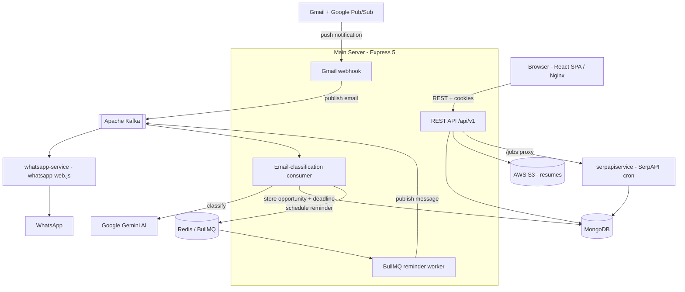

# MailOra

**Connects to your inbox, automatically detects job/internship/hackathon emails with AI, and sends WhatsApp reminders before every deadline.**

MailOra watches a connected Gmail account, uses Google Gemini to classify each incoming email into an opportunity type and pipeline stage (registration → registered → in-progress → confirmed), extracts deadlines and application links, and schedules WhatsApp reminders so a deadline never slips. It's built for students and early-career job seekers who track dozens of applications across a noisy inbox.

[](https://github.com/nrokzzzz/mail-or-a-frontend-backend/actions/workflows/ci.yml)


---

## Live Demo

🔗 **[mail-or-a.dev](https://mail-or-a.dev)**

> _TODO: confirm the deployment is live and publicly reachable, and add demo/guest credentials here if you want recruiters to log in without connecting their own inbox._

---

## Key Features

- **Inbox-aware opportunity tracking** — connect a Gmail account via OAuth; new emails are ingested automatically through Gmail push notifications (Google Pub/Sub).
- **AI email classification** — Google Gemini sorts each email into a category (job, internship, hackathon, workshop) and a pipeline stage, then writes a concise summary.
- **Automatic deadline + link extraction** — application deadlines and registration links are pulled out of the email body so they're never buried.
- **WhatsApp deadline reminders** — push-based reminders are scheduled as delayed jobs and delivered before each deadline (no polling cron).
- **Multi-provider sign-in** — email/password with OTP email verification, plus Google and Microsoft OAuth.
- **Resume storage** — upload PDF/DOCX resumes; files are stored in S3 and parsed server-side.
- **Job feed** — a dedicated microservice pulls IT job listings on a schedule and surfaces them in the dashboard.
- **Resilient by design** — Kafka with dead-letter queues for fault-tolerant processing, a circuit breaker around the AI provider, and graceful shutdown handling.

---

## Tech Stack

Pulled directly from the service manifests in this repo.

**Frontend** — `client/`
- React 19, React Router 7
- Vite 8, Tailwind CSS 4
- Framer Motion, React Hot Toast, React Icons
- `pdfjs-dist` (in-browser resume preview), `react-phone-number-input`
- Axios

**Backend** — `server/` (main API + Kafka consumers)
- Node.js 20, Express 5
- Mongoose 9 (MongoDB)
- JWT (`jsonwebtoken`) + `bcryptjs`, cookie-based sessions
- Joi validation, Helmet, CORS, `express-rate-limit`
- `googleapis` (Gmail), Microsoft OAuth, Nodemailer (OTP/reset emails)
- Multer + AWS SDK v3 S3, `pdf-parse`, `mammoth` (DOCX)
- Jest (tests + coverage)

**AI**
- Google Gemini (`@google/generative-ai`, `gemini-2.5-flash`) for email classification, fronted by a custom circuit breaker

**Messaging / Async**
- Apache Kafka (`kafkajs`) — email-classification and WhatsApp-message topics, each with a DLQ
- BullMQ + ioredis (Redis) — delayed-job scheduling for reminders
- `node-cron` — Gmail watch renewal, sync backfill, and job-feed refresh

**Microservices**
- `whatsapp-service/` — Express 4 + `whatsapp-web.js` + KafkaJS (WhatsApp delivery)
- `serpapiservice/` — Express 5 + Mongoose + `node-cron` (SerpAPI job ingestion)

**Database**
- MongoDB 7 (MongoDB Atlas in production)

**Infrastructure**
- Docker + Docker Compose (full stack: client, server, both microservices, Kafka, Zookeeper, MongoDB, Redis)
- Nginx (serves the production React build)
- GitHub Actions CI (server tests + coverage, client build, Docker build verification)

---

## Architecture

MailOra is a service-oriented system. The Express server owns auth, inbox sync, and the data model; heavy or failure-prone work (AI classification, WhatsApp delivery) is pushed onto Kafka so it can retry independently; reminders are scheduled as delayed Redis jobs rather than polled.



**Ports** (from `docker-compose.yml`): client `80`, server `5000`, serpapiservice `5001`, whatsapp-service `5002`, Kafka `9092`, MongoDB `27017`, Redis `6379`, Zookeeper `2181`.

---

## Getting Started

### Prerequisites
- **Node.js 20+** and npm
- **Docker + Docker Compose** (recommended — runs the entire stack)
- Or, for manual runs: local **MongoDB**, **Redis**, and **Kafka** instances
- API credentials: **Gemini API key**, **Google OAuth** (+ Pub/Sub topic), **Microsoft OAuth**, **AWS S3**, **SerpAPI key**

### Quick start (Docker — full stack)
```bash
git clone https://github.com/nrokzzzz/mail-or-a-frontend-backend.git
cd mail-or-a-frontend-backend

# Create the env files referenced by docker-compose (see below)
#   server/.env, client/.env, whatsapp-service/.env, serpapiservice/.env

docker-compose up --build
```
This brings up the client (`:80`), server (`:5000`), both microservices, Kafka + Zookeeper, MongoDB, and Redis. The compose file overrides `MONGO_URI`, `REDIS_URL`, and `KAFKA_BROKERS` to point at the in-network containers.

### Manual run (per service)
```bash
# Server
cd server && npm install && npm run dev      # http://localhost:5000

# Client
cd client && npm install && npm run dev      # http://localhost:5173

# WhatsApp microservice (scan the QR printed in the terminal on first run)
cd whatsapp-service && npm install && npm run dev   # http://localhost:5002

# Job-feed microservice
cd serpapiservice && npm install && npm run dev     # http://localhost:5001
```

### Available scripts
| Service | Dev | Production | Other |
| --- | --- | --- | --- |
| `server` | `npm run dev` | `npm start` | `npm test` (Jest + coverage) |
| `client` | `npm run dev` | `npm run build` → `npm run preview` | `npm run lint` |
| `whatsapp-service` | `npm run dev` | `npm start` | — |
| `serpapiservice` | `npm run dev` | `npm start` | — |

### Environment variables

**`server/.env`**
```dotenv
PORT=5000
NODE_ENV=development
FRONTEND_URL=http://localhost:5173
MONGO_URI=mongodb://localhost:27017/mailora
JWT_SECRET=                       # secret for signing auth tokens
EMAIL_ENCRYPTION_KEY=             # key used to encrypt stored email/account data

# AI
GEMINI_API_KEY=

# Google OAuth + Gmail push
GOOGLE_CLIENT_ID=
GOOGLE_CLIENT_SECRET=
GOOGLE_REDIRECT_URI=
GOOGLE_AUTH_REDIRECT_URI=
GOOGLE_PUBSUB_TOPIC=

# Microsoft OAuth (Azure App registration)
MICROSOFT_CLIENT_ID=
MICROSOFT_CLIENT_SECRET=
MICROSOFT_REDIRECT_URI=

# Transactional email (OTP / password reset)
EMAIL_USER=
EMAIL_PASS=

# AWS S3 (resume storage)
AWS_ACCESS_KEY_ID=
AWS_SECRET_ACCESS_KEY=
AWS_REGION=
S3_BUCKET_NAME=

# Messaging / async
KAFKA_BROKERS=localhost:9092
KAFKA_CLIENT_ID=mailora-server
REDIS_URL=redis://localhost:6379     # use rediss:// (TLS) in production
REMINDER_WORKER_CONCURRENCY=10
WHATSAPP_SERVICE_URL=http://localhost:5002
```

**`client/.env`**
```dotenv
VITE_BASE_URL=
VITE_API_URL=
```

**`serpapiservice/.env`**
```dotenv
PORT=5001
NODE_ENV=development
MONGO_URI=
SERPAPI_KEY=
FRONTEND_URL=
```

**`whatsapp-service/.env`**
```dotenv
KAFKA_BROKERS=localhost:9092
NODE_ENV=development
# TODO: confirm any additional vars (PORT / service URL) used by whatsapp-service/server.js
```

---

## Screenshots

> Add images under `docs/screenshots/` and link them here.

**Landing page**


**Dashboard / inbox** — _TODO: add screenshot_


**WhatsApp reminder** — _TODO: add screenshot or short demo GIF_


---

## Project Status / Roadmap

**Status:** Active development (server `v2.0.0`). Core flow — Gmail sync → AI classification → deadline tracking → WhatsApp reminders — is implemented, with CI running server tests, client build, and Docker build verification on every push.

Recently added / in place:
- Push-based Gmail ingestion with watch renewal and a periodic sync backfill
- Kafka with dead-letter queues; circuit breaker around the AI provider
- BullMQ delayed-job reminders (replaced the old polling cron)

Roadmap _(TODO: confirm/prune to match your actual plans)_:
- [ ] Broaden inbox support beyond Gmail (Outlook/Microsoft Graph sync)
- [ ] In-app and email reminder channels alongside WhatsApp
- [ ] Analytics on application funnel (response/conversion rates)
- [ ] Expanded automated test coverage across modules

---

> _Built as a full-stack project demonstrating an event-driven microservice architecture: AI integration, message queuing with DLQs, OAuth, and containerized multi-service deployment._
